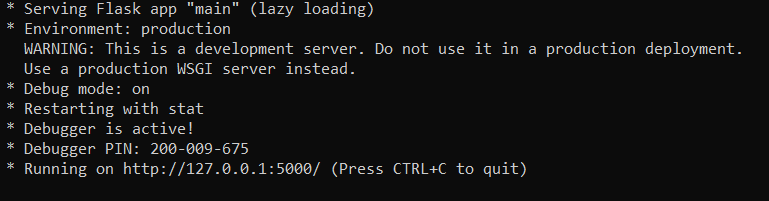

<p align="center">
  
  <h3 align="center">Flyrics - Lyrics On The Fly</h3>
  <p align="center">Did you ever want to sing along to a song but don't know the lyrics? 
  <br />
  Tired of going through the tedious process of searching for multiple sites to find the right lyrics?
  <br />
  <br />
  <strong>We have a solution!</strong>
  <br />
  <br />
  Flyrics uses Artifical Intelligence and Machine Learning to generate lyrics for a song in a matter of minutes. 
  <br />
  No need to search online databases just to find out the lyrics to a song.
  <br />
  Check out the project details below in order to learn how flyrics works, and get started right away!
  <br />
  <br />
  <a href="https://github.com/AhadKhan98/Flyrics/issues">Report Bug</a>
    ·
    <a href="https://github.com/AhadKhan98/Flyrics/issues">Submit Feature</a>
  </p>
</p>
<hr>

## How it Works

Flyrics uses an Artifical Intelligence and a Machine Language approach to generate lyrics on the fly. The project is divided into a backend (python & flask) and a frontend (react native). The user is able to either record a sample of a song, or upload an already existing file in the frontend. The frontend then communicates with the flask server in the backend which is responsible for all of the processing. This processing includes the usage of a python library spleeter which uses a trained model to separate the vocals from the song that was inputted. The vocals are then slowed down in order to increase speech recognition accuracy. The slowed file is passed on to Google's Speech-to-Text API which handles the conversion of the vocals into text. The result is a JSON object which is passed back to the frontend. Finally, the result is displayed in the frontend and the files that were created in the backend are deleted to save disk space.

## Getting Started

The process of getting started is twofold, and is described below.

#### Cloning The Repo
1. Make sure you have git installed on your computer.
2. Run the following command to clone the repo: ```git clone https://github.com/AhadKhan98/Flyrics.git```


#### Firing Up The Backend Server
1. Browse into the ```flask-backend``` folder.
2. Make sure you have python3 and pip installed.
3. Install dependencies using the following command:
``` pip install -r requirements.txt ``` OR ``` pip3 install -r requirements.txt ```
4. Run the following command to start the server: ```python main.py``` OR ```python3 main.py```
5. If you see a message like the one below, you have successfully started the backend server.


#### Running The Frontend App
Add instructions here..

## Contributing
We would absolutely love for you to help us in making Flyrics better by contributing to our project. Head to the [Contributors](https://github.com/AhadKhan98/Flyrics/blob/master/CONTRIBUTORS.md) page to get started right away!

## Code of Conduct
We promote an open and a welcoming environment in this community. We pledge to making participation in our project and our community a harassment-free experience for everyone, regardless of age, body size, disability, ethnicity, sex characteristics, gender identity and expression, level of experience, education, socio-economic status, nationality, personal appearance, race, religion, or sexual identity and orientation.
Learn more about our [Code of Conduct](https://github.com/AhadKhan98/Flyrics/blob/master/CODE-OF-CONDUCT.md).

## Video Demo
Video goes here when we are done..

## License
[MIT @ MLH Fellowship 2020](https://github.com/AhadKhan98/Flyrics/blob/master/LICENSE)

Made by [Ahad Zai](https://github.com/ahadkhan98) and [Saurabh Suryan](https://github.com/sksuryan) during MLH Fellowship Explorer Sprint 3 (Fall 2020)

